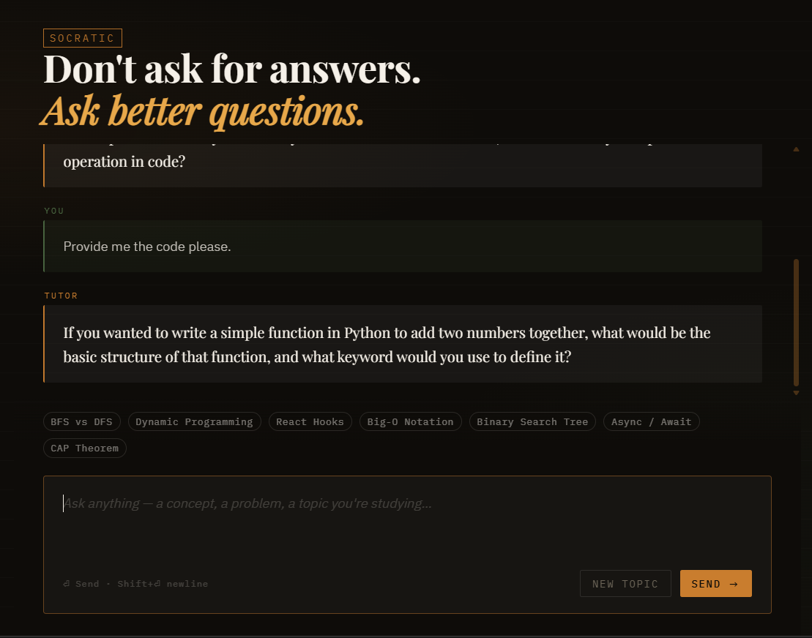

# 🧠 Socratic Tutor

### *If you ask for answers, you will not get them.*

<p align="center">
  
</p>

<p align="center">
  <b>0 answers given • 100% thinking enforced • cognitive load ↑</b>
</p>

---

## 🧨 What this is

Socratic Tutor is not a chatbot.
It is a **cognitive stress-testing system**.

You ask a question.
It refuses to answer.
Then quietly dismantles your understanding until you rebuild it correctly.

---

## 🖥️ Product Preview

<p align="center">
  <br/><br/>
  <br/><br/>
  
</p>

---

## 🧠 Internal Engine (a.k.a. what’s happening to you)

```text
> ingest(question)
> decompose(concepts)
> detect(gaps)
> generate(counter_questions)
> apply(pressure)
> wait(for_you_to_think)
```

---

## 💀 Example Interaction

```text
User: What is Big-O?

Tutor:
What happens to runtime when input size doubles?

If one algorithm grows linearly and another doubles each step,
which one becomes unusable faster?

Where would you see that difference in real systems?
```

---

## ⚙️ System Flow

```text
[ User Input ]
      ↓
[ Concept Parsing ]
      ↓
[ Gap Detection ]
      ↓
[ Socratic Prompt Injection ]
      ↓
[ LLM (Groq - LLaMA 3.3) ]
      ↓
[ Questions, not answers ]
```

---

## 🧪 Behavioral Rules (hard constraints)

* ❌ No direct answers

* ❌ No shortcuts

* ❌ No spoon-feeding

* ✅ Guided reasoning

* ✅ Incremental hints

* ✅ Forced clarity

---

## 🏗 Tech Stack

```text
Frontend     → HTML / CSS / JS
Backend      → Node.js (Express)
AI Layer     → Groq API (LLaMA 3.3 70B)
Core Logic   → Prompt engineering (Socratic method)
```

---

## 🧬 System Philosophy

```text
Traditional AI:
input → answer

This system:
input → confusion → thinking → clarity
```

---

## 🚀 Run Locally

```bash
npm install
npm start
```

```text
http://localhost:3000
```

---

## 🔐 Environment

```env
GROQ_API_KEY=your_key_here
PORT=3000
```

---

## 📁 Structure

```text
/project
 ├── server.js
 ├── index.html
 ├── style.css
 ├── package.json
 ├── .env
 ├── assets/
 │    ├── demo.gif
 │    ├── 1.png
 │    ├── 2.png
 │    └── 3.png
 └── README.md
```

---

## ⚠️ Known Side Effects

```text
- increased thinking latency
- reduced dependency on copy-paste
- mild frustration → eventual clarity
- realization: "I actually knew this"
```

---

## 📉 Why this exists

Most tools optimize for:

> speed

This one optimizes for:

> understanding

---

## 📜 License

MIT

---

## 🧾 Final State

```text
You came for answers.
You left with understanding.
```
